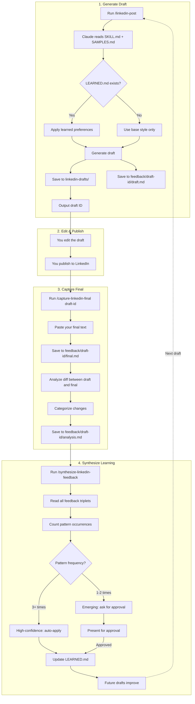

# Writing Style Feedback Loop

A system for learning from your edits to improve AI-generated LinkedIn drafts over time.

## How It Works

This system implements a feedback loop inspired by academic research on learning user preferences from edits. Instead of fine-tuning a model, it extracts interpretable preference descriptions from the differences between AI drafts and your final published versions.



## Quick Start

### Step 1: Generate a Draft

```
/linkedin-post
```

Claude generates a draft and outputs something like:

```
Draft saved to: linkedin-drafts/2026-01-18-four-days-shipping.md
Draft ID: 2026-01-18-four-days-shipping

To capture your final version after publishing:
  /capture-linkedin-final 2026-01-18-four-days-shipping
```

### Step 2: Edit and Publish

1. Copy the draft content
2. Edit it in your preferred tool
3. Publish to LinkedIn

### Step 3: Capture Your Final

After publishing, run:

```
/capture-linkedin-final 2026-01-18-four-days-shipping
```

Then paste your final published text when prompted. The system will:
- Save your final version
- Analyze what you changed
- Extract preferences from your edits

### Step 4: Synthesize Learning (Periodic)

After capturing a few finals, run:

```
/synthesize-linkedin-feedback
```

This aggregates patterns across all your edits and updates `LEARNED.md`.

## Understanding the Draft ID

The **draft ID** is an internal identifier (not a LinkedIn URL). It follows the format:

```
YYYY-MM-DD-<topic-slug>
```

Examples:
- `2026-01-18-four-days-shipping`
- `2026-01-15-project-phases`
- `2026-01-12-accessibility-fixes`

The draft ID ties together:
- Your original draft (`feedback/<id>/draft.md`)
- Your final version (`feedback/<id>/final.md`)
- The analysis (`feedback/<id>/analysis.md`)

## File Structure

```
.claude/skills/writing-style/
├── README.md         # This file
├── SKILL.md          # Voice and style guidelines
├── SAMPLES.md        # Curated example posts with annotations
├── LEARNED.md        # Synthesized preferences from your feedback
└── feedback/
    ├── 2026-01-18-four-days-shipping/
    │   ├── draft.md      # Claude's original draft
    │   ├── final.md      # Your published version
    │   └── analysis.md   # Diff analysis and extracted patterns
    └── 2026-01-15-project-phases/
        ├── draft.md
        ├── final.md
        └── analysis.md
```

## What Gets Learned

The system categorizes your edits into:

| Category | What It Tracks | Example |
|----------|----------------|---------|
| **Structural** | Length, paragraph order, sections | "Shortened from 280 to 215 words" |
| **Tone** | Hedging, directness, formality | "Removed 'I think', added 'That's a lie'" |
| **Word Choice** | Specific replacements | "Changed 'utilize' → 'use'" |
| **Content** | Added/removed information | "Added ISS tracker anecdote" |
| **Format** | Hashtags, bullets, emojis | "Reduced from 7 to 3 hashtags" |

### Confidence Levels

- **High-confidence (3+ occurrences)**: Auto-applied to future drafts
- **Emerging (1-2 occurrences)**: Shown for your approval before adding
- **Anti-patterns**: Things you consistently remove

## Research Foundation

This system is inspired by recent academic research on learning from user edits:

### PRELUDE/CIPHER (NeurIPS 2024)

**Paper**: [Aligning LLM Agents by Learning Latent Preference from User Edits](https://arxiv.org/abs/2404.15269)
**Code**: [github.com/gao-g/prelude](https://github.com/gao-g/prelude)

Key insight: Instead of fine-tuning, use the LLM to analyze (draft, edit) pairs and infer descriptive preferences. These descriptions are added to prompts for future generations. Evaluated on email writing tasks, achieving lowest edit distance over time.

### PLUME/PROSE (2025)

**Paper**: [Aligning LLMs by Predicting Preferences from User Writing Samples](https://arxiv.org/html/2505.23815v1)

Builds on CIPHER with improved preference extraction, outperforming it by 33%.

### Personalized RLHF (P-RLHF)

**Paper**: [Personalized Language Modeling from Personalized Human Feedback](https://arxiv.org/abs/2402.05133)

Framework for capturing individual preferences without model retraining, using lightweight user models.

## Tips for Better Learning

1. **Be consistent**: The more consistently you make certain edits, the faster they become high-confidence patterns

2. **Capture every final**: Even small edits contain signal

3. **Run synthesis periodically**: After 3-5 new captures is a good cadence

4. **Review emerging patterns**: The approval step helps catch false positives

5. **Check LEARNED.md**: It's human-readable, so you can manually edit it if the system learns something wrong
